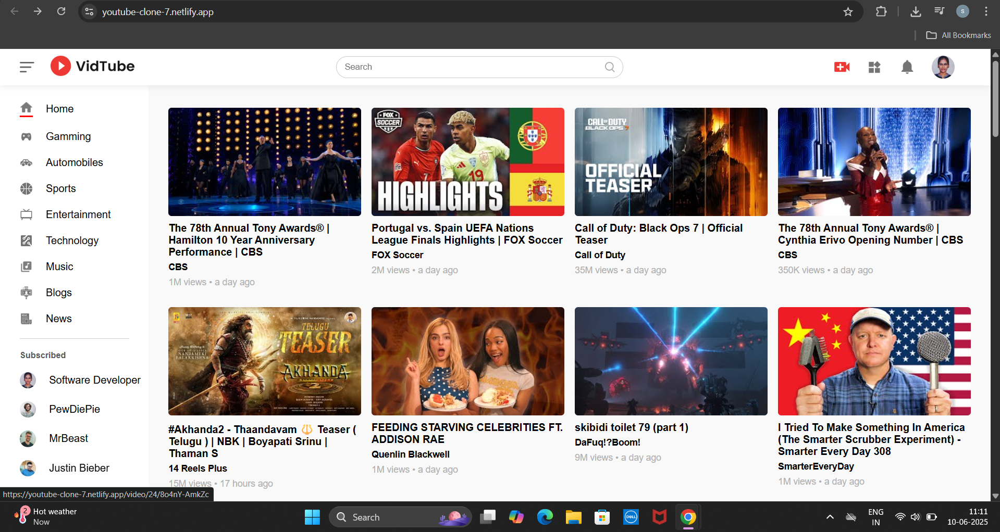

# 📺 YouTube Clone — VidTube

A responsive front-end YouTube clone built with **React**, styled with CSS, and deployed via Netlify.  
Mimics the YouTube interface with a video grid, sidebar navigation, search UI, and responsive layout.

---

## 🔗 Live Demo

🌐 [Visit the Live Site](https://youtube-clone-7.netlify.app)

---

## 🚀 Features

- 🎞️ Video thumbnail grid layout    
- 📱 Fully responsive (works on desktop & mobile)  
- 🧭 Sidebar navigation with categories  
- 🎥 Clickable static video cards (video page simulated)  
- 💡 Built purely with React components

---

## 💻 Technologies Used

- **React.js** (Vite)  
- **JavaScript (ES6+)**  
- **CSS3** (Flexbox / Grid / Responsive design)  
- **Netlify** for deployment

---

## 📷 Screenshots

### 💻 Desktop View  

### 📱 Mobile View  

